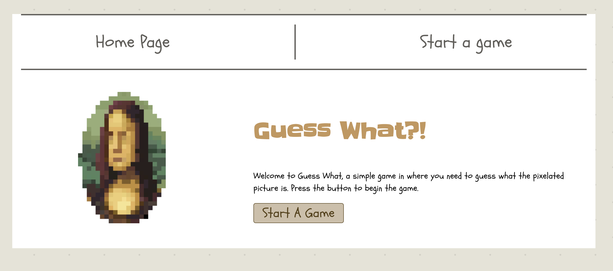
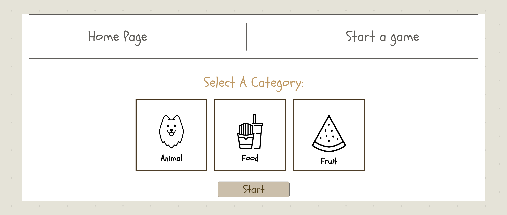
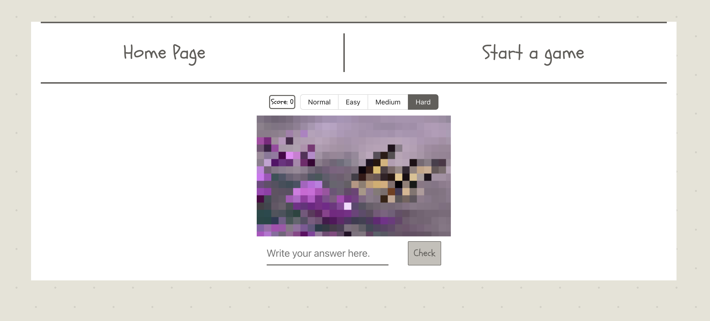

# Guess-What-Game
> a simple game in where you need to guess what the pixelated picture is. 

## Table of Contents
* [General Info](#general-information)
* [Technologies Used](#technologies-used)
* [Screenshots](#screenshots)
* [Setup](#setup)
* [Room for Improvement](#room-for-improvement)
<!-- * [License](#license) -->

## General Information
- This project is a simple game that, fetches images from the Unsplash API endpoint and uses the React Pixelate package to pixalate the picture.

- The game has three categories: Animal, Food, Fruit.

-The level of game can be chosen by changing pixel size from easy to hard.

- If the answer is wrong the game will warn you with a message.
- The scores are being kept.

<!-- You don't have to answer all the questions - just the ones relevant to your project. -->

## Technologies Used
- React
- MongoDB
- TypeScript
- JavaScript
- HTML
- CSS

## Screenshots

<!-- If you have screenshots you'd like to share, include them here. -->

## Setup
 Project requirements/dependencies are all listed in package.json file.

## Room for Improvement
To do:
- Add more categries.
- writing proper tests.

<!-- Optional -->
<!-- ## License -->
<!-- This project is open source and available under the [... License](). -->

<!-- You don't have to include all sections - just the one's relevant to your project -->